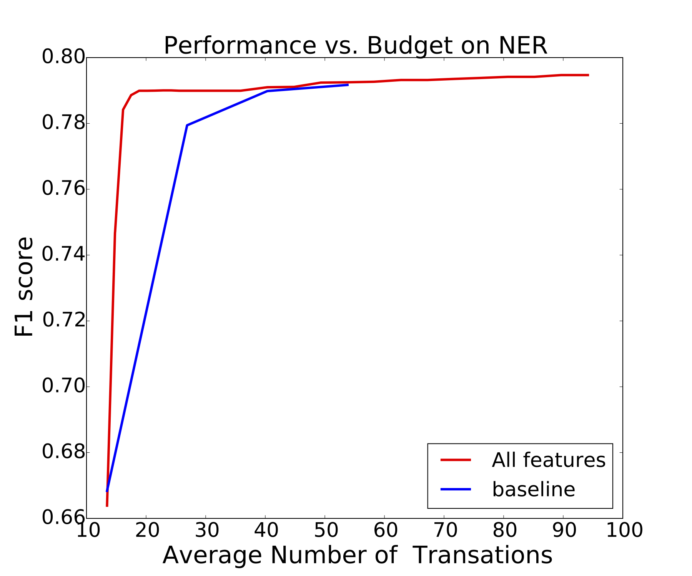
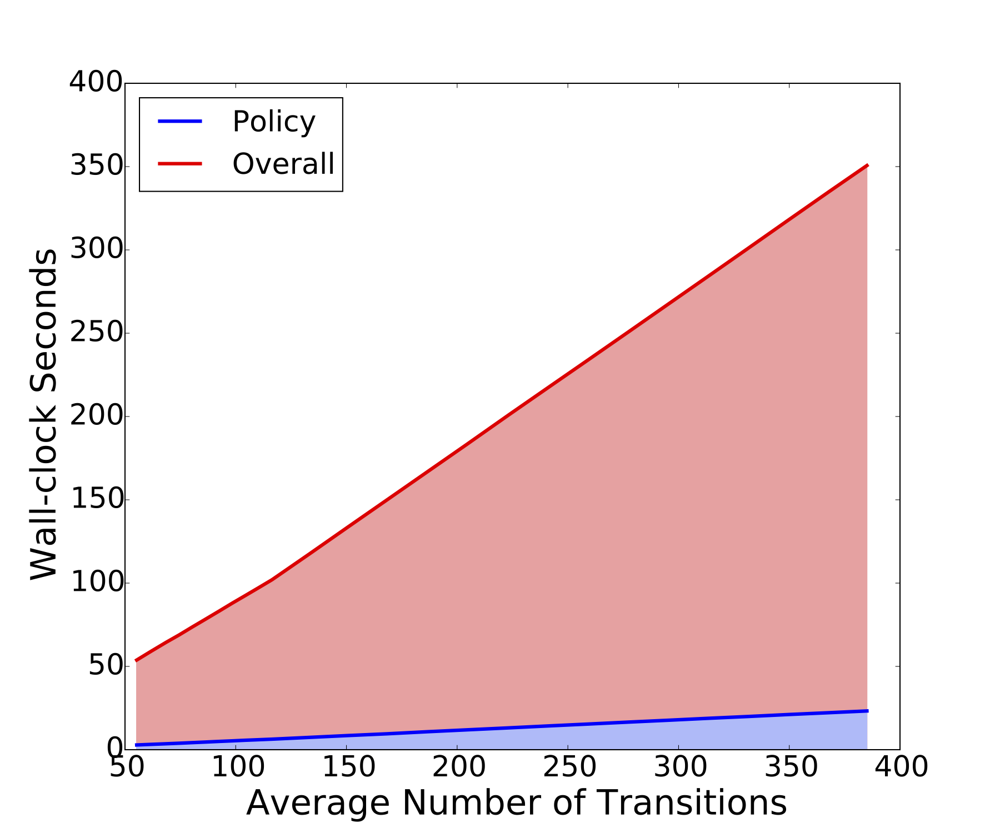

HeteroSampler [](https://travis-ci.org/strin/HeteroSampler)
=============

This project is a C++ implementation of HeteroSamplers: heterogenous Gibbs samplers for structured prediction problems. It is based on algorithms published in the AISTATS 2015 paper 

>Shi Tianlin, Jacob Steinhardt, and Percy Liang 

><a href="http://stanford.edu/~tianlins/research/adainfer.pdf">Learning Where to Sample in Structured Prediction</a>

>18th International Conference on Artificial Intelligence and Statistics


How does it work
----------------
Taking a pre-trained model and its Gibbs sampler, the algorithm uses reinforcement learning to figure out which part of the structured output needs more sampling, and hence require more computational resources.


Installing HeteroSampler
-------------
This release is for early adopters of this premature software. Please let us know if you have comments or suggestions. Contact: tianlinshi [AT] gmail.com


HeteroSampler is written in C++ 11, so requires gcc >= 4.8. It also uses HDF5 for reading some type of model data. It is partially built on <a href="http://hci.iwr.uni-heidelberg.de/opengm2/">OpenGM</a>, a open-source graphical model toolbox.

Dependencies (Ubuntu)
---------------------
To install gcc 4.8,

```
sudo add-apt-repository -y ppa:ubuntu-toolchain-r/test;
sudo apt-get update -qq
sudo apt-get install -qq g++-4.8
export CXX="g++-4.8"
```

Install cmake to bulid the source code

```
sudo apt-get install cmake
```

Install boost-program-options

```
sudo apt-get install libboost-all-dev
```

Install Hierarchical Data Format (HDF 5):

```
sudo apt-get install libhdf5-serial-dev
```


Dependencies (OS X, Homebrew)
-----------------------------

Installation
-------------
```
cmake .
make
```

The compilation will create the directory "bin/". All binary executables will be located in it.

Example
=======

Pre-Train a Sequence Tagging Model
-----------------------------------------------------

To pre-train an NER model, run <i>tagging</i> with the following parameters:

```
./bin/tagging --T 8 --B 5 --train data/eng_ner/train --test data/eng_ner/test --eta 0.3 --depthL 2 --windowL 2 --factorL 2 --output model/eng_ner/gibbs.model --scoring NER --Q 1 --log 'log/eng_ner/log' --testFrequency 1
```

| Parameters | Meaning |
|------------------|--------------|
|        T            |   number of Gibbs sweeps over each training instance |
|        B            |   number of burn-in steps for Gibbs sweeps |
|     train         |  path for training data |
|     test          |     path for test data     |
|    eta            |   learning rate (AdaGrad) |
|   depthL      |  up to which input column is used as input  |
|  windowL    |  window size for features like x_j - y_i |
| factorL        |  factor size, e.g. if factorL = 1, use features y_{i-1} - y_i - y_{i+1} |
| output         | output file to store the pre-trained model |
| scoring        | NER or Acc. NER = F1 score, Acc = Accuracy |
| Q                 | number of passes over the training dataset |
| log              |  path for log file | 
| testFrequency | over what percentage of the training set to run a test |


Scripts have been written for training various types of models, including

```
# learn NER model 
./script/learn_ner.sh
# learn POS model on WSJ dataset
./script/learn_wsj.sh
```


Run Gibbs Policy on the Pre-Trained Model
-------------------------------------------------
```
./bin/policy --type tagging --policy gibbs --output result/eng_ner/gibbs  --model model/eng_ner/gibbs_small.model --train  data/eng_ner/train_small --test data/eng_ner/test_small --eta 1 --T 4   --log log/eng_ner/gibbs
```
| Parameter | Meaning |
|-----------|---------|
| type      | the specific task to solve (tagging / ocr / ising / opengm) |
| policy    | which policy to use (gibbs / adaptive) |
| output    | where to dump the results |
| model     | where to load the pre-trained model |
| train     | location of training dataset |
| test      | location of test dataset |
| eta       | meta step size of AdaGRAD used in policy training |
| T         | the computational resource contraint, how many effective passes are made |
| log       | where to log |


Run Adaptive Policy on the Pre-Trained Model
--------------------------------------------
Adaptive policy uses Gibbs policy as exploration strategy during training. It learns a block policy that selects which example and which part to sample at run time. 

The command line interface of adaptive policy is the same. 

```
./bin/policy --type tagging --policy adaptive --output result/eng_ner/adaptive  --model  model/eng_ner/gibbs.model --train  data/eng_ner/train --test data/eng_ner/test --eta 1 --T 6  --feat 'sp cond-ent bias nb-vary nb-discord' --reward 0  --log log/eng_ner/adaptive
```

except ```--policy adaptive``` and the ```--feat``` option. The ```--feat``` option takes a list of strings, seperated by space, each of which representing a meta-feature used.

| Meta-Feature  | Meaning |
|-------------------|---------|
| bias | always equal to 1.0 |
| cond-ent | stale entropy value of the position conditional on its Markov blanket |
| unigram-ent | the entropy of the position based on a unigram model (required option --unigram_model to specify the model path)|
| sp | how many times this position has been sampled |
| nb-discord | discord with neighboring positions in the Markov blanket |
| nb-vary    | how many neighbors have changed since last sampling the position |


Make Plots
----------
To make the budget and overhead figures as in our paper, run the python script in ```bin/```:

```
python bin/plot.py ner budget
```

```
python bin/plot.py ner overhead
```

The figures are generated in ```result/eng_ner/budget.pdf``` and ```result/eng_ner/overhead.pdf```.

<div style="text-align:center">
  

 
</div>


Citation
========
If our software helps you in your work, please cite

<i>Shi, Tianlin, Jacob Steinhardt, and Percy Liang. "Learning Where to Sample in Structured Prediction." Proceedings of the Eighteenth International Conference on Artificial Intelligence and Statistics. 2015.</i>

License (GPL V3)
========

Copyright (C) 2014 Tianlin Shi

This program is free software: you can redistribute it and/or modify
it under the terms of the GNU General Public License as published by
the Free Software Foundation, either version 3 of the License, or
(at your option) any later version.

This program is distributed in the hope that it will be useful,
but WITHOUT ANY WARRANTY; without even the implied warranty of
MERCHANTABILITY or FITNESS FOR A PARTICULAR PURPOSE.  See the
GNU General Public License for more details.

You should have received a copy of the GNU General Public License
along with this program.  If not, see <http://www.gnu.org/licenses/>.
